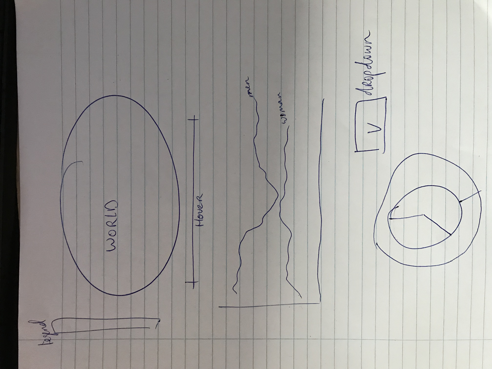

## Data
The data s retrieved from www.kaggle.com in a csv-format. This means that transforming to a json-format is needed in order to use it within javascript. It took me a hell of a job to link the data to every country's 'Alpha3-code' which is required to be able to have the data shown when hovering over the world map.

## Visualizations
Below is my idea of visualising this project:
The users is shown a map of the world with countries in different colors. This is determined according to a colorscale and shown in a legend to clarify. By using the hover-function (based upon years), data adjusts to the right data per country for the correct year. After the users clicks on a country, a linegraph will appear which will show the overall data for a country for both men and woman for a specific age. Furthermore, a pie chart and donut chart appear for that specific country. With a dropdown-function the user is able to change the numbers for other ages.

## Code
I made several folders to have a clear distinction between python, javascript, html and css. Furthermore, seperate folders are made to divide data-specific files from function-specific files.
