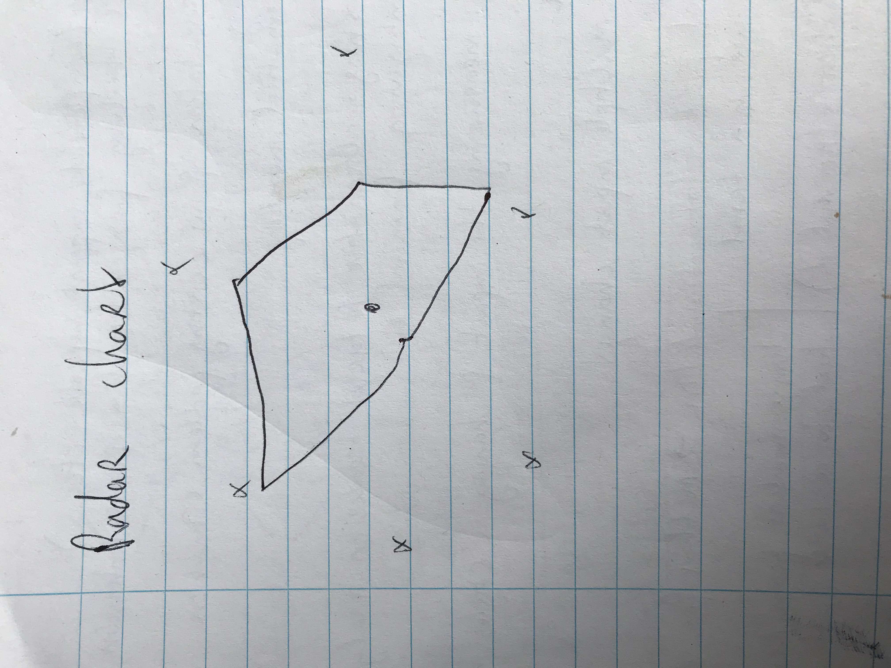

## Data
De data is afkomstig van www.opendata.cbs.nl en is in de vorm van een csv-formaat gedownloaded. Dit dien ik echter voor gebruik met javascript om te zetten in een json-bestand.
De data is onderverdeeld in de volgende componenten:
- De rijen zijn de provincies in Nederland en de jaartallen lopen vanaf 1996 tot en met 2015
- De kolommen zijn onderverdeeld in zeven soorten bodemgebruik, namelijk: Verkeersterrein, Bebouwd terrein, Semi-Bebouwd, Recreatie, Bos, Natuurlijk terrein, Water Nederland

## Visualizations

Hieronder zie je de geschetste versie van mijn idee:
Zoals gezegd verschijnt de map van Nederland met een hoover eronder. Hiermee kun je door de tijdspanne gaan om zo te zien hoe het bodemgebruik (van bebouwing + semi-bebouwing) was voor dat specifieke jaartal. Wanneer je stop op een jaartal en klikt op een provincie, danm verschijnt linksonder een lijngrafiek met daarin de data van wederom bebouwing + semi-bebouwing weergeven door de jaren. Middels een dropdown-optie kun je ervoor kiezen om andere vorem van bodemgebruik te weergeven in de linegraph.

Door het stoppen op het jaartal en het klikken op een province, verschijnt er rechtsonder een radar-chart met de waarden van alle vormen van bodemgebruik in desbetreffend jaar voor desbetreffende provincie.

## Code

Alle visualisaties zullen in een apart bestand gemaakt worden en enkel in de index.js zal hiernaar verwezen worden. Dit om de overzichtelijkheid te bewaren. Daarnaast worden verscheidene functies binnen de site middels mappen van elkaar gescheiden. Zo is er een genaamd 'docs' voor de screenshots en foto's die wergeven worden op de site, een genaamd 'data' waarin data ingelezen, geanalyseerd en verwerkt wordt tot bruikbare bestanden. De laatste map heet 'code' en hieronder vallen de submappen 'css' (wat de opmaak van de site verzorgt) en 'js' (waarin de visualisaties worden gemaakt).
