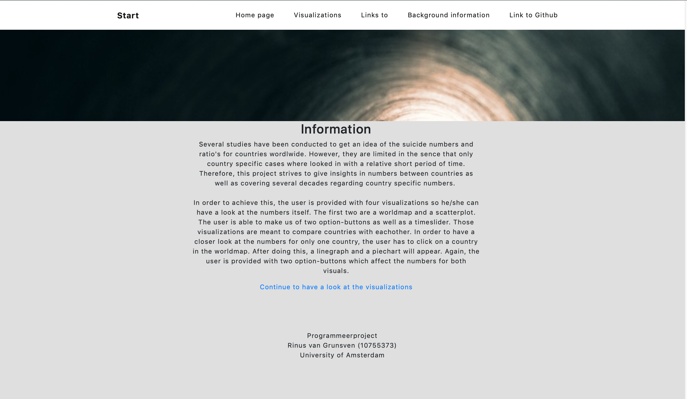
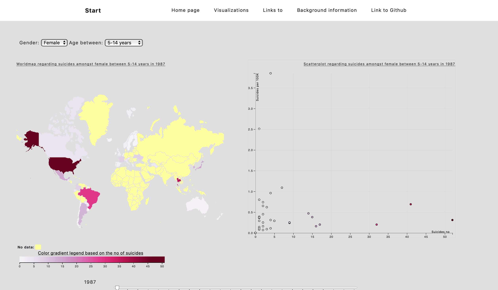
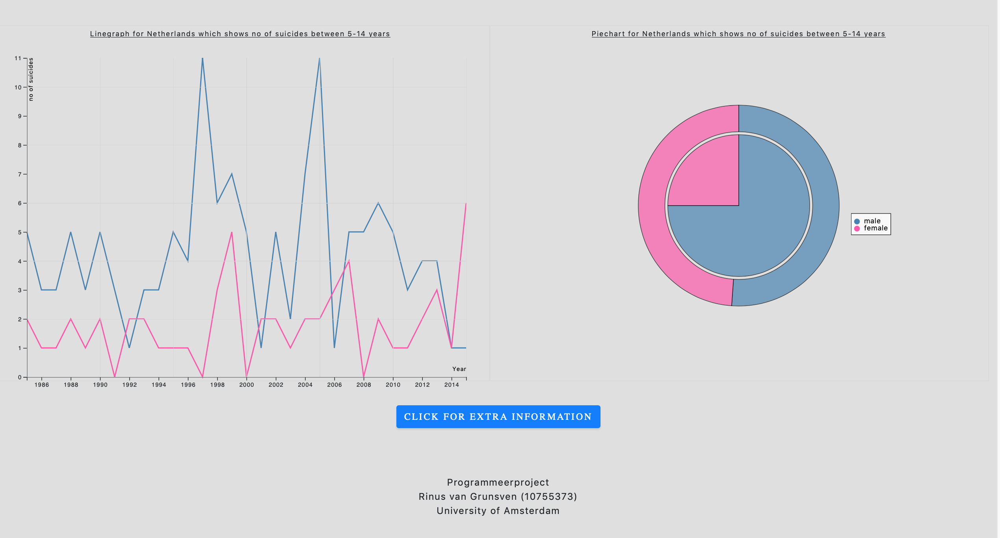

# Eindproject

Eindproject minor programming UvA (low speed, 2018 - 2019)

## Personal information

Rinus van Grunsven
10755373
University of Amsterdam

## Project proposal

Visualization regarding the numbers of suicide (both in absolute numbers as well as in a ratio per 100.000 capita).

## Problem Statement

Many scientists throughout the world have had a look a the suicide reasons, numbers, and rates amongst men and woman in countries worldwide since there are many gender differences with regard to suicides. Several studies concluded that men are likely to die from suicide three times more often than woman (see: http://www.bbc.com/future/story/20190313-why-more-men-kill-themselves-than-women), other studies found out that the number was vastly increasing for woman and rather decreasing for men (see: https://www.samaritans.org/about-samaritans/research-policy/suicide-facts-and-figures/) whilst other studies concluded that the overall suicide number was increasing heavily (source: https://www.scotsman.com/health/number-of-suicides-recorded-in-scotland-rises-by-15-in-a-year-1-4954440).
This seamed to me like there wasn't any pattern that could be derived from it as well as numbers were completely different for countries. Whilst reading more and more about it, I got interested in two things: what are the differences between countries and in what sense are the above conclusions underscored when having a look at open source data. Those questions came up for the following reasons: the first one is that most of the studies were limited in the sense that they only compared numbers of men and woman for a short period of time (mostly not even a decade) as well as not making a clear distinction in the men/woman-population ratio who're living a country. Furthermore, comparisons between countries weren't made and that's, at least in my opinion, interesting because the studies have concluded various different conclusions.
Therefore, to be able to say something about developments throughout a long period of time, developments between men and woman from different stages in life and differences between countries, additional research is required.

## Solution

In order to do such research, I'm going to visualize several things with data retrieved form an open data source. My idea for this research is a follows: in order to say something about developments throughout time, visualizations are very much needed. Therefore, at the end of this project, three interactive visualizations are shown to the user to provide them with a clear overview so he/she can come to a comprehensive answer. Furthermore, in this way I strive to be able to provide the user with something which enhances his/her perception of the numbers per country, age, and sex.

## Data Sources

The data is retrieved from www.kaggle.com as a csv-file (source: https://www.kaggle.com/russellyates88/suicide-rates-overview-1985-to-2016).

## Visualizations

Here's a link to the website:
[Visualizations](https://10755373.github.io/eindproject/)

link github: https://10755373.github.io/eindproject/

link adjusted:
https://10755373.github.io/eindproject/index.html

First of all, the screenshots placed below are all put in the folder 'assets' instead of the folder 'docs' (this folder contains screenshots used earlier during the project) since they weren't visualized in this README.md (I don't know why but I can't help it any further). 

See below for other visualizations:
When opening the website, you'll first be redirected to the homepage (see below). Here you'll get some informaiton about the topic, why I decided to visualize it and how it has been done by me. See below for a screenshot:

When going to the visualization-page, you'll first see a worldmap and a scatterplot. By adjusting the values in the dropdowns and by hovering over the year-slider, both visualizations will change. In this way, I aimed to compare countries with eachother whilst providing the user with the opportunity to show the numbers he/she is interested in. See below for a screenshot:

The linegraph, piechart and donut are set as default on The Netherlands in the year 1987, with absolute numbers being shown for the age group 5 - 14 years. By clicking on a country in the worldmap, the linegraph, piechart and donut will adjust itself with the data for that specific country you just clicked on. See below for a screenshot:

## External components

- d3 (for the slider and legend)
- Topojson
- Bootstrap
- jQuery
- pyCountry

## Author

Rinus van Grunsven
