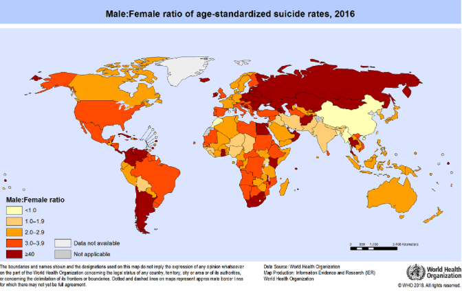
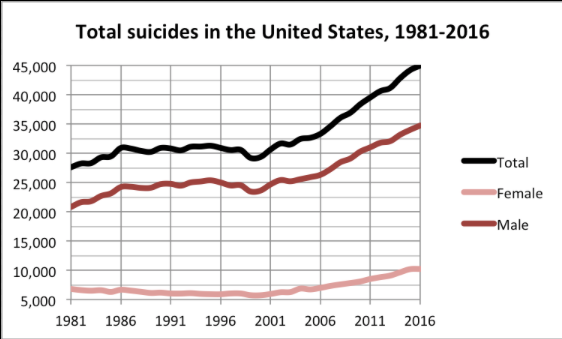

# Final project minor programming UvA (low speed, 2018 - 2019)

## Rinus van Grunsven - 10755373

## Project proposal: Weergave van veranderingen in het Nederlandse landschap

## Problem Statement

Many scientists throughout the world have had a look a the suicide reasons, numbers, and rates amongst men and woman in countries worldwide since there are many gender differences with regard to suicides. Several studies concluded that men are likely to die from suicide three times more often than woman whilst other studies found out that the number was vastly increasing for woman and rather decreasing for men. Those studies were limited in the sense that they only compared numbers of men and woman for a short period of time (mostly not even a decade) as well as not making a clear distinction in the men/woman-population ratio who're living a country. Therefore, to be able to say something about developments throughout a long period of time and developments between men and woman from different stages in life, new investigation is required.

## Solution
My idea for this investigation is a follows: in order to say something about developments throughout time, visualizations are very much needed. Therefore, at the end of this project, three interactive visualizations are shown to the user to provide them with a clear overview so he/she can come to a comprehensive answer. Furthermore, in this way I strive to be able to provide the user with something which enhances his/her perception of the numbers per country, age, and sex.

## Data Sources

The data is retrieved from www.kaggle.com as a csv-file.

## Similar Visualizations

See below for other visualizations:

## External components

- d3 (probably with several extensions)
- Topojson
- Bootstrap
- jQuery

Similar example:

## Hardest parts

The interactions between different visuals as well as the world map (I've had a lot of struggles with that during the 'linked-views'-project of data processing) and the pie chart and donut chart in once I think.
