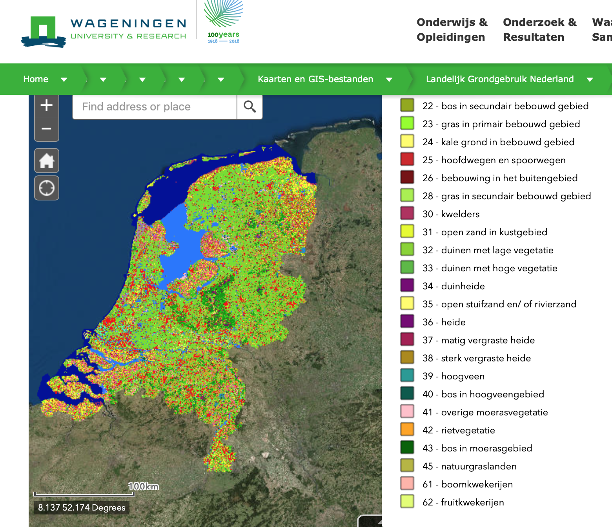

# eindproject

## Rinus van Grunsven - 10755373

## Project proposal: Weergave van veranderingen in het Nederlandse landschap

## Problem Statement

Volgens een artikel van het CBS uit 2015 is het bodemgebruik in Nederland constant in beweging (zie: https://www.cbs.nl/nl-nl/nieuws/2017/10/minder-landschap-meer-bebouwing-1950-2015). Hierover ontstaat meer en meer tegenstrijdige informatie in mijn ogen. Zo is bijvoorbeeld de landbouw met 4% gestegen (zie: https://www.cbs.nl/nl-nl/nieuws/2017/03/export-landbouw-stijgt-met-ruim-4-procent) terwijl er juist minder aan landbouw gedaan wordt (zie: https://www.cbs.nl/nl-nl/nieuws/2016/08/minder-landbouw-meer-natuur) en landbouw in verscheidene provincies minder beoefend wordt (zie: https://www.1limburg.nl/landbouw-verliest-terrein-limburg && https://www.boerderij.nl/Home/Achtergrond/2019/3/Ruim-9-krimp-landbouwareaal-Flevoland-tot-2040-402181E/).

## Solution

Kortom, het Nederlandse landschap is aan veranderingen onderhevig en de meningen lopen uiteen wat betreft de omvang van de verschillende vormen van bodemgebruik. Om een helder, duidelijk en overzichteljk beeld te creëeren over de veranderingen over verloop van tijd is dit project vereist.

## Data Sources

De data is afkomstig van www.opendata.cbs.nl en gedownloaded als csv bestand wat erna voor verder gebruik omgezet dient te worden in een json-bestand.

## Similar Visualizations

Zie hieronder voor een screenshot welke van de website van de Wageningen University is genomen:

## External components

- d3 (misschien met extensies)
- Topojson
- Bootstrap
- jQuery

Similar example:

## Hardest parts

De interactie tussen de verschillende grafieken wordt mijns inziens lastig om op elkaar af te stemmen, dit merkte ik tijdens het 'Linked views'-opdracht van dataprocessing namelijk al. Daarnaast lukte het visualiseren van de worldmap toentertijd niet optimaal dus ik vrees daar wederom een hoop tijd aan kwijt te zijn. Als laatste zal de opmaak en lay-out van de site meer moeite gaan kosten dan dat ik nu denk ben ik bang.
